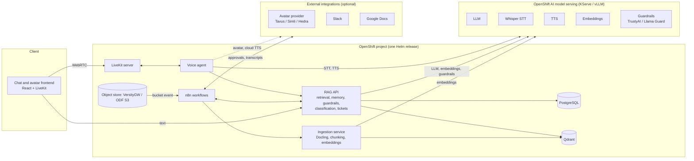

# Deploy an enterprise voice and avatar assistant on OpenShift AI

Ground a voice-enabled, avatar-fronted assistant in your company documents with RAG, n8n workflows, and models served on Red Hat® OpenShift® AI.

> **Status: complete.** Everything described here is deployed and demonstrated; [docs/SETUP.md](docs/SETUP.md) is the reference for the setup script, [docs/deployment.md](docs/deployment.md) has the installation detail and [docs/development.md](docs/development.md) the layout of the repository.

## Table of Contents

- [Overview](#overview)
- [Detailed description](#detailed-description)
  - [See it in action](#see-it-in-action)
  - [Architecture diagrams](#architecture-diagrams)
- [Requirements](#requirements)
  - [Minimum hardware requirements](#minimum-hardware-requirements)
  - [Minimum software requirements](#minimum-software-requirements)
  - [Required user permissions](#required-user-permissions)
  - [Third-party accounts and keys](#third-party-accounts-and-keys)
- [Setup](#setup)
- [Deploy](#deploy)
  - [Prerequisites](#prerequisites)
  - [Installation](#installation)
  - [Validating the deployment](#validating-the-deployment)
  - [Delete](#delete)
- [Demo walkthrough](#demo-walkthrough)
- [References](#references)
- [Technical details](#technical-details)
  - [How it works](#how-it-works)
  - [Configuration](#configuration)
  - [Local development](#local-development)
- [Tags](#tags)

## Overview

Employees lose time hunting through policies and procedures, and service desks spend hours on requests that follow the same intake, approval and fulfillment pattern. This quickstart deploys a virtual assistant that answers questions from your own documents with citations, speaks through a lip-synced avatar, and turns spoken requests into tracked tickets approved in Slack. It is for platform and AI teams that need a sovereign assistant: the models, the data and the workflows all run on Red Hat OpenShift AI in your own cluster. After deploying, you upload documents, ask questions by text or voice, drop in an invoice for field extraction, and file a service request end to end.

## Detailed description

Knowledge in most organizations is scattered across PDFs, Word documents, wikis and ticketing systems. Chat assistants built on public APIs can answer questions, but they send sensitive content off-platform, cannot show where an answer came from, and rarely close the loop on what follows a question, such as approving a request or updating a ticket. Voice and avatar interfaces make assistants approachable for frontline staff, kiosks and accessibility use cases, but real-time speech is hard to run privately.

This quickstart shows how Example Corp, a fictional company, runs an assistant that answers from its own policy and procedure documents with source citations, remembers the conversation across text and voice, and lets people interrupt the avatar mid-sentence. Incoming documents such as invoices and contracts are classified and their fields extracted before being routed to Slack or a downstream system. Service requests made by chat or voice are classified, sent to Slack for approval, fulfilled and tracked, and the assistant tells the requester the outcome. Transcripts are archived to Google Docs and re-indexed, so the assistant can answer questions about earlier conversations. Typical scenarios are IT and HR help desks, procurement intake, and front-desk or kiosk assistants in regulated industries where data must not leave the organization.

After deployment you can:

- Upload documents and watch them parsed, indexed and confirmed in Slack
- Ask questions by text or voice and see the passages each answer is based on
- Interrupt the avatar mid-sentence and ask a follow-up that needs the earlier context
- Drop an invoice into the inbox bucket and receive its type and extracted fields in Slack
- File a request by voice, approve it in Slack, and hear the assistant confirm the outcome
- Archive a conversation to Google Docs and ask about it later
- Swap the avatar provider or point the language model at a remote endpoint with one value

### See it in action


The avatar greets the person by name and speaks the answers; the chat shows the same text with its citations, and the Sources panel shows the passages behind them. The status bar lists the models behind the session, served on OpenShift AI. A presenter script with timings and expected answers is in [docs/demo-script.md](docs/demo-script.md).

### Architecture diagrams


<details>
<summary>Diagram source (Mermaid)</summary>



</details>

How data moves through the system:

1. **Ingestion.** Documents land in an S3 bucket (VersityGW, deployed by the chart, or OpenShift Data Foundation) or Google Drive. A bucket notification triggers the n8n ingestion workflow, which calls the ingestion service. Docling parses the file, chunks are embedded with the embeddings model, and vectors with source and page metadata are upserted into Qdrant.
2. **Text question.** The frontend calls the RAG API. The API checks input guardrails, retrieves the top chunks from Qdrant, loads recent history from PostgreSQL, calls the LLM, checks output guardrails, stores the exchange, and returns an answer with citations.
3. **Voice question.** The browser connects over WebRTC to the LiveKit server. The voice agent transcribes speech with Whisper, calls the same RAG API, synthesizes the reply with the TTS model, and hands audio to the avatar provider, which publishes lip-synced video back into the room.
4. **Service requests.** When a chat or voice message is a request rather than a question, the RAG API classifies it, opens a ticket in PostgreSQL, and hands it to the n8n approval workflow. The decision made in Slack is written back to the ticket and pushed into the same conversation as a notice, which the avatar speaks and the chat shows.
5. **Workflows.** Classification, request intake, Slack approvals, and transcript archival run as n8n workflows that call the RAG API and the Slack and Google Docs integrations.

| Component | Role | Runs as | Talks to |
|---|---|---|---|
| Frontend | Chat with citations, voice session, avatar video | nginx serving a React app, proxies `/api` to the RAG API | RAG API, LiveKit |
| RAG API | Retrieval, guardrails, memory, request intake, tickets, notices | FastAPI | LLM, embeddings, guardrails model, Qdrant, PostgreSQL, n8n |
| Ingestion | Docling parsing, chunking, embedding, indexing | FastAPI | object store, embeddings model, Qdrant, PostgreSQL |
| Voice agent | Turn detection, transcription, spoken answers, avatar hand-off | LiveKit Agents worker | LiveKit, Whisper, RAG API, TTS, avatar provider |
| LiveKit | WebRTC signaling and media, TURN over TLS | LiveKit server | browsers, voice agent, avatar provider |
| n8n | Ingestion, classification, approvals, archival, SLA and digest workflows | n8n with the workflows shipped in the chart | RAG API, ingestion, Slack, Google Docs |
| Models | Llama 3.1 8B or the cluster's Llama 3.2 3B (LLM), Whisper (STT), BGE-M3 (embeddings), Kokoro (TTS); Granite Guardian (guardrails) optional, off in the demo | vLLM on OpenShift AI (GPU); Kokoro on CPU | called over OpenAI-compatible APIs |
| Datastores | PostgreSQL (conversations, memory, tickets, notices), Qdrant (vectors), VersityGW S3 object store (documents, inbox, transcripts) | Deployments with PVCs | the services above |

## Requirements

### Minimum hardware requirements

Application components, per replica, using the chart defaults:

| Component | CPU request / limit | Memory request / limit | Storage |
|---|---|---|---|
| Frontend | 100m / 500m | 128 MiB / 256 MiB | none |
| RAG API | 500m / 2 vCPU | 1 GiB / 2 GiB | none |
| Ingestion service | 1 vCPU / 4 vCPU | 2 GiB / 8 GiB | none |
| Voice agent | 500m / 2 vCPU | 1 GiB / 2 GiB | none |
| LiveKit server | 500m / 2 vCPU | 512 MiB / 2 GiB | none |
| n8n | 250m / 1 vCPU | 512 MiB / 1 GiB | 8 GiB PVC |
| PostgreSQL | 250m / 1 vCPU | 512 MiB / 1 GiB | 10 GiB PVC |
| Qdrant | 250m / 1 vCPU | 512 MiB / 2 GiB | 10 GiB PVC |
| Object store (VersityGW) | 100m / 1 vCPU | 128 MiB / 512 MiB | 20 GiB PVC |

Models served on OpenShift AI, only if you deploy them with the chart instead of pointing at existing endpoints:

| Model | Example | GPU | CPU / Memory |
|---|---|---|---|
| LLM | Llama 3.1 8B Instruct on vLLM | 1 NVIDIA GPU with 24 GiB or more (L4, A10G, L40S, A100) | 4 vCPU / 16 GiB |
| Speech-to-text | Whisper large-v3-turbo on vLLM | 1 NVIDIA GPU with 16 GiB or more, or shared with the LLM | 2 vCPU / 8 GiB |
| Text-to-speech | Kokoro or Orpheus | Optional. CPU is sufficient for demo load | 2 vCPU / 4 GiB |
| Embeddings | BGE-M3 on vLLM | 1 NVIDIA GPU with 16 GiB or more (the chart default), or a CPU or remote endpoint for light load | 2 vCPU / 8 GiB |
| Guardrails (optional, off by default) | Granite Guardian 3.3 8B on vLLM | 1 NVIDIA GPU with 24 GiB or more | 4 vCPU / 16 GiB |

> **Note:** If all models are hosted remotely, on OpenShift AI in another project or at a Models-as-a-Service provider, this quickstart needs no GPU in the cluster.

### Minimum software requirements

- Red Hat OpenShift 4.16 or later
- Red Hat OpenShift AI 3.5 or later with KServe in standard deployment mode and the vLLM ServingRuntime enabled
- NVIDIA GPU Operator and Node Feature Discovery Operator, only if deploying GPU models with the chart
- A default StorageClass that supports ReadWriteOnce volumes
- Client tools: `oc` 4.16 or later and `helm` 3.14 or later (`scripts/setup.sh` installs `helm` into `~/bin` when it is missing)
- Optional: the OpenShift GitOps operator (Argo CD) for the GitOps deployment path
- Optional: the TrustyAI component of OpenShift AI, only for the `trustyai` guardrails provider; the demo runs without guardrails
- Optional external services: a Slack workspace with a bot token, a Google Cloud service account with the Drive API enabled, and an avatar provider account (Tavus, Simli, or Hedra). See [Third-party accounts and keys](#third-party-accounts-and-keys)

Tested with (September 2026, single node with 4x NVIDIA L4):

| Component | Version |
|---|---|
| Red Hat OpenShift | 4.20.35 |
| Red Hat OpenShift AI | 3.5.0, KServe standard deployment mode |
| NVIDIA GPU Operator | 25.3.4 (also verified by a contributor with 26.3.3) |
| Node Feature Discovery Operator | 4.20.0 |
| NVIDIA driver / CUDA | 580.82.07 / 13.0 on NVIDIA L4 (from the GPU operator) |
| vLLM runtime image | `registry.redhat.io/rhaii/vllm-cuda-rhel9` (vLLM 0.24.0, CUDA 13.0), pinned by digest in `chart/values.yaml` |
| OpenShift GitOps (optional) | 1.21.4 |
| cert-manager operator (optional, trusted ingress certificate) | 1.20.0 |
| n8n | 2.37.11 |
| LiveKit server | 1.13.6 |
| PostgreSQL / Qdrant / VersityGW | 16 / 1.19.1 / 1.8.0 |
| Kokoro TTS (kokoro-fastapi) | 0.8.2 |
| Helm client | 3.14 or later (tested with 3.17 and 4.2) |

Read the driver and CUDA versions of your own GPU nodes from the labels set by the GPU operator: `oc get nodes -L nvidia.com/cuda.driver-version.full,nvidia.com/cuda.runtime-version.full`.

### Required user permissions

This quickstart deploys as a regular OpenShift user with:

- Permission to create a project, or an existing project where you are an admin
- Permission to create Deployments, StatefulSets, Services, Routes, PersistentVolumeClaims, Secrets, and ConfigMaps in that project
- Permission to create InferenceServices and ServingRuntimes in that project, only if deploying models with the chart

No cluster admin access is required. Two caveats:

- PostgreSQL, Qdrant, the object store (VersityGW), and n8n are deployed by the chart itself rather than by cluster-wide operators, so no operator installation is needed.
- The LiveKit server must expose WebRTC media to browsers. On OpenShift this is done with LiveKit's built-in TURN server over TLS behind a passthrough Route, which needs a certificate the browser trusts. See `livekit.turn` in the values file.

Cluster administrators who start from a bare cluster can install the platform prerequisites with the manifests in [deploy/bootstrap/](deploy/bootstrap/README.md).

### Third-party accounts and keys

All optional: Tavus (or Simli, Hedra) for avatar video, Slack for notifications and approvals, Google Docs for transcript archival. Where to get each key, where it goes, and the free-tier caveats are in [docs/deployment.md](docs/deployment.md#third-party-accounts-and-keys).

## Deploy

## Setup

This section takes a freshly provisioned OpenShift AI cluster to a working demo: platform
checks, one GPU shared by the model servers, every key and integration created from
scratch, the chart deployed through Argo CD, n8n wired to Slack and Google Docs, the sample
documents loaded, and a verification at the end. One interactive script on the bastion
host drives it; it discovers what the cluster already has, shows the progress, runs the next
step, and saves its progress so it can be stopped and resumed at any point.

### What is assumed

Red Hat employees can provision the environment from the Red Hat Demo Platform catalog item
[Red Hat OpenShift AI 3](https://catalog.demo.redhat.com/catalog/babylon-catalog-prod?item=babylon-catalog-prod/published.openshift-ai-v3.prod);
anyone else needs a cluster with the same properties.

| Assumed | Detail |
|---|---|
| 1. OpenShift Container Platform 4.20, single-node (SNO) | One AWS GPU instance runs everything. OpenShift Lightspeed is enabled on it (not used by the assistant) |
| 2. Red Hat OpenShift AI 3 | Installed from the `stable-3.x` channel, with KServe enabled and the supporting operators from the environment's own guide: cert-manager, Node Feature Discovery, NVIDIA GPU Operator, Red Hat Connectivity Link |
| 3. A Llama 3.2 3B Instruct model deployed as `llama-32-3b-instruct` | Deployed from the OpenShift AI model catalog by following the environment's guide (project `my-first-model`, vLLM, no token authentication). The assistant uses it as its language model |
| 4. A bastion host | SSH access with `oc` logged in as `kubeadmin`; the provisioning e-mail or Showroom page has the host, user and password. Every command below runs there |
| Instance size | `g6.8xlarge`: 32 vCPU, 128 GB RAM, one NVIDIA L4 with 24 GB. Every `g6.*xlarge` size has one L4; `g6.12xlarge` and `g6.24xlarge` have four |

The environment auto-stops after six hours and is destroyed after 48. Disable auto-stop in
RHDP if you keep it, and expect to redo the setup on a new cluster; the script makes that a
short exercise.

Accounts for the integrations, all free: a Slack workspace where you can create apps and
channels, a [Tavus](https://platform.tavus.io) account for the avatar (25 conversational
minutes a month, one stream), and a Google account with access to Google Cloud console for a
service account that writes the transcripts to Drive. No GitHub or Quay account is needed:
the images are public on Quay and Argo CD reads this public repository.

### Run it

Three commands on the bastion host: SSH in with the host, user and password from the
provisioning e-mail, clone, run.

```bash
ssh lab-user@bastion.<guid>.<base domain>
```

```bash
git clone https://github.com/rh-ai-quickstart/enterprise-voice-avatar-assistant.git ~/enterprise-voice-avatar-assistant && cd ~/enterprise-voice-avatar-assistant
```

```bash
scripts/setup.sh
```

The script logs in to the cluster if the bastion is not (it asks for the API URL, the user
and the password), shows the state of nine steps, and runs the remaining ones in order. It
stops only for the keys and browser actions of step 5 or when a step fails, and resumes where
it stopped on the next run. The steps:

1. **Cluster and prerequisites**: versions, KServe, operators, GPUs, the deployed model, storage.
2. **Deployment profile**: decided from the GPUs found; too few or too small, and it stops with what is required, what the cluster has, and the options.
3. **Cluster bootstrap**: missing operators, GPU time-slicing, the deployed model's GPU share lowered to 55% so Whisper (15%) and BGE-M3 (12%) fit next to it, Argo CD, the project.
4. **TURN certificate**: the cluster's wildcard certificate copied into the project, or one from Let's Encrypt.
5. **Keys and integrations**: one file, `~/secrets.env`; the n8n owner login, the Slack app, the Tavus key, the Google service account and the Drive folder, each browser action shown one at a time and each value verified against the service.
6. **Deploy with Argo CD**: the application with the domain, the model endpoint and the profile; waits for the sync, the models and the pods; runs the connectivity test.
7. **n8n workflows**: owner account, API key, Slack credential and workflows are created by the chart; this step checks that all seven are active.
8. **Sample documents**: fifteen files uploaded and indexed.
9. **Verification**: `scripts/demo-preflight.sh`, then the URLs and the demo script.

Every step checks the cluster before acting, so work done by hand or by an earlier run is
recognised. The options (`--status`, `--step N`, `--yes`, `--reset`), the files the script
keeps, what each step checks and changes, remote model endpoints instead of GPUs, day-two
operations and the symptoms seen per step are in [docs/SETUP.md](docs/SETUP.md);
[docs/troubleshooting.md](docs/troubleshooting.md) lists the rest by area.

### Prerequisites

Before deploying, ensure you have:

- Access to an OpenShift cluster with OpenShift AI installed that meets the requirements above
- `oc` installed and logged in (`oc whoami` returns your user)
- `helm` installed (`scripts/setup.sh` installs it for you)
- Run `scripts/check-prereqs.sh` after logging in; it reports anything missing and which permissions you lack
- Model endpoints ready: either existing OpenAI-compatible endpoints (MaaS) with API keys, or GPU capacity to deploy models with the chart
- Optional: a Slack bot token, a Google Cloud service account key for Google Docs, and an avatar provider key (Tavus, Simli or Hedra); see [Third-party accounts and keys](#third-party-accounts-and-keys)

### Installation

1. Clone the repository:

```bash
git clone https://github.com/rh-ai-quickstart/enterprise-voice-avatar-assistant.git
cd enterprise-voice-avatar-assistant
```

2. Run the installer in the project you want to use (it creates the project if it does not exist):

```bash
PROJECT=voice-avatar-assistant scripts/deploy.sh
```

   The script detects the cluster apps domain, creates the secrets (generated passwords plus any API keys exported in your environment), installs the chart with the models served on OpenShift AI, waits for pods and models, and prints the URLs. Add `RUN_TESTS=1` to finish with the connectivity test, or pass Helm arguments such as `-f my-values.yaml`.

3. Open the frontend URL it prints. The n8n workflows are imported and published automatically on first start; if `SLACK_BOT_TOKEN` was in the environment, Slack is wired too. Google Docs needs a one-time sign-in in n8n.

#### Alternative deployment options

**Remote models.** `MODELS=maas scripts/deploy.sh` prompts for OpenAI-compatible endpoints and keys for the LLM, Whisper and embeddings instead of deploying them; no GPU is needed. Options mix per model.

**Manual Helm steps.** Secrets, `helm install`, per-model options and the n8n workflows step by step: [docs/deployment.md](docs/deployment.md#manual-installation-with-helm).

**Argo CD.** The same chart driven by the OpenShift GitOps operator: this is what [Setup](#setup) does with `scripts/setup.sh`; the manual steps are in [docs/deployment.md](docs/deployment.md#deploying-with-argo-cd).

The generated secrets, how to read, rotate and back them up, are described in [docs/deployment.md](docs/deployment.md#working-with-the-generated-secrets).

### Validating the deployment

`NS=${PROJECT} scripts/demo-preflight.sh -f <your values file>` checks models, the connectivity test pod and the n8n webhooks at any time. If something does not come up, [docs/troubleshooting.md](docs/troubleshooting.md) lists the symptoms seen while building this quickstart with the command that confirms each and the fix.

1. Check that all pods are running. Model pods can take several minutes to download weights on first start.

```bash
oc get pods -n ${PROJECT}
```

2. Get the frontend URL and open it in a browser:

```bash
echo https://$(oc get route/frontend -n ${PROJECT} --template='{{.spec.host}}')
```

3. Run the connectivity test. It checks every enabled service, lists the models, calls embeddings and sends one chat completion to the LLM (for Argo CD installs use `scripts/test-services.sh`).

```bash
helm test assistant --namespace ${PROJECT} --logs
```

4. Load the sample documents with `NS=${PROJECT} scripts/load-sample-docs.sh`. It uploads the policies in `data/sample-docs/` to the `documents` bucket and the invoices and contracts to `inbox`; the ingestion and classification workflows in n8n run within a few seconds. You can also upload single files through the object store's web UI (below; sign in with the keys in `assistant-object-store`) or with `scripts/load-sample-docs.sh <path>`.

```bash
echo https://$(oc get route/object-store -n ${PROJECT} --template='{{.spec.host}}')/ui/
```

5. Ask a question about the uploaded document in the frontend. The answer should include citations pointing at the file and page.

### Delete

1. Uninstall the Helm release:

```bash
helm uninstall assistant --namespace ${PROJECT}
```

2. Remove the persistent volumes. Helm keeps them by default so data survives upgrades.

```bash
oc delete pvc -l app.kubernetes.io/instance=assistant -n ${PROJECT}
```

3. (Optional) Delete the project:

```bash
oc delete project ${PROJECT}
```

## Demo walkthrough

The demo follows one storyline, from deployment to portability. Each step builds on the previous one.

1. **Deploy the full stack** with a single `helm install` (or an Argo CD sync), then show the pods, Routes, and InferenceServices coming up.
2. **Upload company documents** to the `documents` bucket (the object store's web UI, or `scripts/load-sample-docs.sh <file>`) and watch the ingestion workflow run in n8n: parse, chunk, embed, index, notify.
3. **Ask a question in text.** The answer is grounded in the uploaded documents and the citations panel shows the source file and page.
4. **Ask the same question by voice.** The avatar answers with lip-synced speech. Interrupt it mid-sentence to show barge-in.
5. **Ask a follow-up question** that only makes sense with context. The assistant uses conversation memory from PostgreSQL to resolve it.
6. **Drop an invoice or contract** into the bucket. The classification workflow identifies the document type, extracts fields to JSON, and posts the result to Slack.
7. **Submit a service request by voice.** A ticket is created in PostgreSQL, an approval request appears in Slack, and after approval the avatar confirms fulfillment.
8. **Show the transcript** saved to Google Docs and re-ingested, then ask a question that the transcript answers.
9. **Open the OpenShift AI dashboard** to show the served models and their metrics, then the Qdrant and PostgreSQL data behind the demo.
10. **Swap the avatar provider or the LLM endpoint** with a values change and redeploy, demonstrating portability and data sovereignty.

A presenter script with timings, exact questions and expected answers is in [docs/demo-script.md](docs/demo-script.md).

## References

- [Red Hat OpenShift AI documentation](https://docs.redhat.com/en/documentation/red_hat_openshift_ai_self-managed)
- [Serving models with vLLM on OpenShift AI](https://docs.redhat.com/en/documentation/red_hat_openshift_ai_self-managed/latest/html/serving_models/)
- [Docling](https://docling-project.github.io/docling/)
- [Qdrant](https://qdrant.tech/documentation/)
- [n8n](https://docs.n8n.io/)
- [LiveKit Agents](https://docs.livekit.io/agents/)
- [TrustyAI Guardrails Orchestrator](https://trustyai.org/docs/main/gorch-tutorial)
- [Llama Guard](https://www.llama.com/docs/model-cards-and-prompt-formats/llama-guard-3/)
- Related quickstarts: [basic-speech-to-text-with-whisper](https://github.com/rh-ai-quickstart/basic-speech-to-text-with-whisper), [RAG](https://github.com/rh-ai-quickstart/RAG), [guardrailing-llms](https://github.com/rh-ai-quickstart/guardrailing-llms), [it-self-service-agent](https://github.com/rh-ai-quickstart/it-self-service-agent)

## Technical details

### How it works

**Model endpoints.** Every model is consumed through an OpenAI-compatible API: chat completions for the LLM and guardrails, audio transcriptions for Whisper, audio speech for TTS, and embeddings for the indexing model. Each model has a `deploy` toggle plus `endpoint` and `servedModelName` values; API keys live in the models Secret. Switching from a local InferenceService to a MaaS endpoint, or to a frontier provider as a fallback, is a values change with no code change. In-cluster endpoints that OpenShift AI serves over TLS are trusted through the OpenShift service CA, which every pod already mounts.

**RAG API.** A FastAPI service that owns retrieval, memory, guardrails, classification, and tickets so that text chat, voice, and n8n all share one grounded answer path. Main endpoints: `POST /v1/chat` (grounded answer with citations and memory), `POST /v1/search` (retrieval only), `POST /v1/classify` (document type and field extraction to JSON), `POST /v1/tickets` and `PATCH /v1/tickets/{id}` (service request state), `GET /v1/voice/token` (LiveKit room token for the browser).

**Ingestion.** Docling converts PDF, DOCX, PPTX, HTML, and images to a structured document. The hybrid chunker produces token-bounded chunks with heading context. Each Qdrant point carries `doc_id`, `source`, `page`, `chunk_index`, and `text`, which is what the citations panel displays. Re-ingesting a document with the same `doc_id` replaces its points.

**Memory and tickets.** PostgreSQL holds `conversations`, `messages` (with citations as JSONB), `user_memory` for long-lived facts, `documents` for classification results, and `tickets` for the request workflow. n8n uses the same database under its own schema.

**Voice.** The voice agent is a LiveKit Agents worker. Silero VAD detects turns and enables interruption, Whisper transcribes, the RAG API produces the answer, and the TTS model synthesizes it. When an avatar provider is configured, the agent hands its audio to the provider, which publishes synchronized video into the room. With no provider configured, the agent publishes audio only.

**Avatar providers.** The provider is selected by a single value (`voiceAgent.avatarProvider`): `none` for audio only, or `tavus`, `simli`, or `hedra` through their LiveKit plugins. The provider only receives the assistant's synthesized speech, never the microphone. A self-hosted renderer built on the LiveKit avatar worker API (MuseTalk on a GPU, or LiteAvatar on CPU) is the planned open-source option.

**Guardrails.** Input and output checks run in the RAG API with a provider switch: `none` (the demo setting), `granite-guardian` (Granite Guardian 3.3 8B served on OpenShift AI), `llama-guard`, or `trustyai` (the TrustyAI Guardrails orchestrator). Blocked requests return a safe message and are logged; answers stream sentence by sentence only with `none`.

**Workflows.** The seven n8n workflows (chat, ingestion, classification, request approval, transcript archival, SLA escalation, knowledge-gap digest) call the RAG API and ingestion service by their in-cluster service names. n8n imports them on first start; the Slack credential is created from the integrations secret, the Google Docs credential is added once in the n8n UI. The **Archive transcript** button in the chat header hands the current conversation to the archival workflow through the RAG API.

**Naming.** Application services use fixed names (`frontend`, `rag-api`, `ingestion`, `voice-agent`, `postgres`, `qdrant`, `object-store`, `n8n`, `livekit`) so that workflows and configuration are stable regardless of the Helm release name. Deploy one release per project.

### Configuration

Everything is a Helm value: models (`deploy` per model, or an `endpoint`), guardrails provider, avatar provider and voice, workflow import policy, sizing. The reference with defaults is [chart/README.md](chart/README.md); the services read the same settings as environment variables from the `assistant-config` config map and the secrets, so a value change restarts only the pods that use it.

### Local development

[docs/development.md](docs/development.md) explains how to run each service on a laptop against a deployed cluster, the tests CI runs, image builds, the sample documents and the workflow files.

## Tags

- **Title:** Deploy an enterprise voice and avatar assistant on OpenShift AI
- **Description:** Ground a voice-enabled, avatar-fronted assistant in your company documents with RAG, n8n workflows, and models served on Red Hat OpenShift AI.
- **Industry:** Media and IT services
- **Product:** Red Hat OpenShift AI
- **Use case:** Productivity, automation
- **Partner:** n8n
- **Contributor org:** Red Hat
